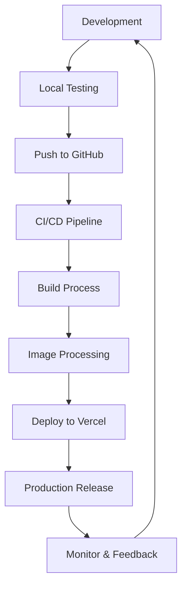

# Preact Responsive Image Project

This project demonstrates a production-ready Preact application with advanced responsive image handling. It includes optimizations, best practices, and features suitable for a production environment.

[](https://vercel.com/new/clone?repository-url=https://github.com/jameswquinn/preact-responsive-image-app)

## Project Overview

The Preact Responsive Image Project showcases:
- Responsive image loading with WebP support and fallbacks
- Intelligent handling of images with alpha channels
- Webpack configuration for development and production
- Code splitting and performance optimizations
- Environment-specific configurations
- Testing setup with Jest
- Linting and formatting with ESLint and Prettier
- Continuous Integration/Continuous Deployment (CI/CD) setup
- Error boundaries for robust error handling

## Project Structure

```
project-root/
├── src/
│   ├── components/
│   │   ├── ResponsiveImage/
│   │   │   ├── ResponsiveImage.js
│   │   │   └── ResponsiveImage.test.js
│   │   └── App/
│   │       ├── App.js
│   │       └── App.test.js
│   ├── utils/
│   │   └── imageUtils.js
│   ├── styles/
│   │   └── global.css
│   ├── index.js
│   └── index.html
├── public/
│   └── images/
│       └── example.png
├── config/
│   ├── webpack.common.js
│   ├── webpack.dev.js
│   └── webpack.prod.js
├── scripts/
│   └── optimize-images.js
├── package.json
├── vercel.json
├── .gitignore
├── .env.example
├── .eslintrc.js
├── .prettierrc
├── jest.config.js
└── README.md
```

## Setup Instructions

1. Clone the repository:
   ```
   git clone https://github.com/jameswquinn/preact-responsive-image-app.git
   cd preact-responsive-image-app
   ```

2. Install dependencies:
   ```
   npm install
   ```

3. Set up environment variables:
   - Copy `.env.example` to `.env.development` and `.env.production`
   - Fill in the required environment variables in each file

4. Place your source PNG images in the `public/images/` directory.

5. Start the development server:
   ```
   npm start
   ```

6. For production build:
   ```
   npm run build
   ```

## Usage

To use the ResponsiveImage component in your Preact application:

```jsx
import ResponsiveImage from './components/ResponsiveImage/ResponsiveImage';

const MyComponent = () => (
  <ResponsiveImage
    src="example.png"
    alt="An example image"
    sizes="(max-width: 600px) 300px, (max-width: 1200px) 600px, 1200px"
  />
);
```

## How It Works

1. During the build process:
   - WebP versions are generated for all images.
   - PNG versions are generated only for images with an alpha channel.
   - JPEG versions are generated for images without an alpha channel.
   - Metadata JSON files are created for each image, storing information about the alpha channel.

2. The ResponsiveImage component:
   - Fetches the metadata for the image.
   - Sets up the appropriate `srcSet` for WebP and fallback images.
   - Uses an `img` tag with `srcSet` to provide both WebP and fallback versions, allowing the browser to choose the best format.

3. Error handling:
   - The component includes error handling for both image and metadata loading failures.
   - An ErrorBoundary component in App.js catches any errors that occur during rendering.

## Project Workflow

The following flowchart illustrates a simplified version of the Preact Responsive Image Project lifecycle:



This simplified diagram shows the main stages of the development and deployment process. The actual workflow includes more detailed steps, such as:
- Linting and formatting checks
- Generating different image formats (WebP, PNG, JPEG) based on alpha channel presence
- Creating metadata JSON files for images
- Running post-deployment tests
- Performance monitoring and optimization

## Scripts

- `npm start`: Start development server
- `npm run build`: Build for production
- `npm test`: Run tests
- `npm run lint`: Lint code
- `npm run format`: Format code
- `npm run optimize-images`: Optimize images in the public directory

## Deployment

### Quick Deploy with Vercel

Click the "Deploy with Vercel" button at the top of this README to deploy the project quickly with Vercel.

### Manual Deployment

This project is set up for deployment on Vercel. To deploy manually:

1. Install Vercel CLI: `npm i -g vercel`
2. Run: `vercel`
3. Follow the prompts to link your project and deploy

## Contributing

Contributions are welcome! Please feel free to submit a Pull Request.

1. Fork the project
2. Create your feature branch (`git checkout -b feature/AmazingFeature`)
3. Commit your changes (`git commit -m 'Add some AmazingFeature'`)
4. Push to the branch (`git push origin feature/AmazingFeature`)
5. Open a Pull Request

## License

This project is licensed under the MIT License.

## Acknowledgments

- [Preact](https://preactjs.com/) for the lightweight React alternative
- [Sharp](https://sharp.pixelplumbing.com/) for the high-performance image processing
- [Webpack](https://webpack.js.org/) for bundling and build process
- [Vercel](https://vercel.com/) for easy deployment options
