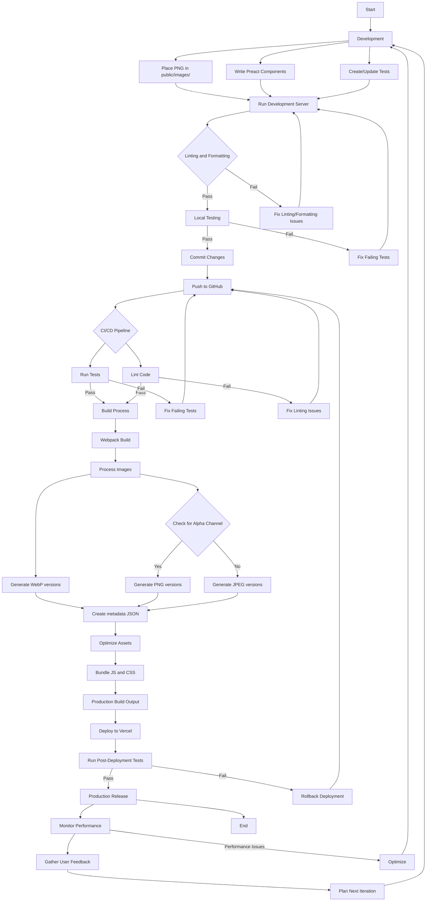

# Preact Responsive Image Project

This project demonstrates a production-ready Preact application with advanced responsive image handling. It includes optimizations, best practices, and features suitable for a production environment.

[](https://vercel.com/new/git/external?repository-url=https://github.com/jameswquinn/preact-responsive-image-app)

## Project Overview

The Preact Responsive Image Project showcases:
- Responsive image loading with WebP support and fallbacks
- Webpack configuration for development and production
- Code splitting and performance optimizations
- Environment-specific configurations
- Testing setup with Jest
- Linting and formatting with ESLint and Prettier
- Continuous Integration/Continuous Deployment (CI/CD) setup

## Project Structure

```
project-root/
├── src/
│   ├── components/
│   │   ├── ResponsiveImage/
│   │   │   ├── ResponsiveImage.js
│   │   │   └── ResponsiveImage.test.js
│   │   └── App/
│   │       ├── App.js
│   │       └── App.test.js
│   ├── utils/
│   │   └── imageUtils.js
│   ├── styles/
│   │   └── global.css
│   ├── index.js
│   └── index.html
├── public/
│   └── images/
│       └── example.png
├── config/
│   ├── webpack.common.js
│   ├── webpack.dev.js
│   └── webpack.prod.js
├── scripts/
│   └── optimize-images.js
├── package.json
├── vercel.json
├── .gitignore
├── .env.example
├── .eslintrc.js
├── .prettierrc
├── jest.config.js
└── README.md
```

## Setup Instructions

1. Clone the repository:
   ```
   git clone https://github.com/yourusername/preact-responsive-image-project.git
   cd preact-responsive-image-project
   ```

2. Install dependencies:
   ```
   npm install
   ```

3. Set up environment variables:
   - Copy `.env.example` to `.env.development` and `.env.production`
   - Fill in the required environment variables in each file

4. Place your source PNG images in the `public/images/` directory.

5. Start the development server:
   ```
   npm start
   ```

6. For production build:
   ```
   npm run build
   ```

## Usage

To use the ResponsiveImage component in your Preact application:

```jsx
import { ResponsiveImage } from './components/ResponsiveImage/ResponsiveImage';

const MyComponent = () => (
  <ResponsiveImage
    src="example.png"
    alt="An example image"
    sizes="(max-width: 600px) 300px, (max-width: 1200px) 600px, 1200px"
  />
);
```

## Project Workflow

The following flowchart illustrates the entire lifecycle of the Preact Responsive Image Project:



This flowchart shows the process from development to production, including:
1. Development phase
2. Local testing and quality checks
3. Version control with GitHub
4. CI/CD pipeline
5. Build process and image optimization
6. Deployment to Vercel
7. Production monitoring and iteration

## Scripts

- `npm start`: Start development server
- `npm run build`: Build for production
- `npm test`: Run tests
- `npm run lint`: Lint code
- `npm run format`: Format code
- `npm run optimize-images`: Optimize images in the public directory

## Deployment

### Quick Deploy with Vercel

Click the "Deploy with Vercel" button at the top of this README to deploy the project quickly with Vercel.

### Manual Deployment

This project is set up for deployment on Vercel. To deploy manually:

1. Install Vercel CLI: `npm i -g vercel`
2. Run: `vercel`
3. Follow the prompts to link your project and deploy

## Contributing

Contributions are welcome! Please feel free to submit a Pull Request.

## License

This project is licensed under the MIT License.
